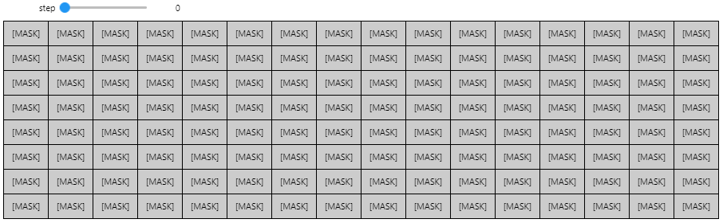
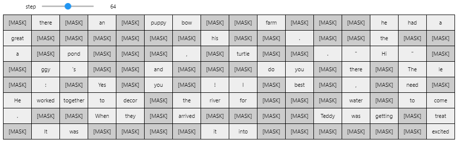
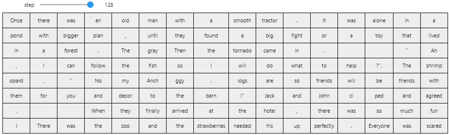

# Discrete Flow Matching implemented in PyTorch

Implementation of Discrete Flow Matching [[1]](https://arxiv.org/abs/2402.04997)[[2]](https://arxiv.org/abs/2407.15595), which is a generative model for generating discrete things such as text with flow matching. The code is implemented in PyTorch.

| Step 0 of 128 (input)      | Step 64 of 128               | Step 128 of 128 (output)       |
| -------------------------- | ---------------------------- | ------------------------------ |
|  |  |  |

## How to run

### Environment setup

1. Install [uv](https://github.com/astral-sh/uv) for package management, e.g. `pip install uv`
2. Make sure Python 3.12 is installed: `uv python install 3.12`
3. Install the dependencies: `uv sync --group jupyter`

Run `python -m discrete_flow_matching_pytorch.train --config configs/conv-8.yaml` to start training a text generation model logging to wandb.

The [sample notebook](notebooks/sample.ipynb) demonstrates the sampling process.

**Note**: Instead of using uv, it is also possible to install the dependencies in [pyproject.toml](pyproject.toml) with pip.

## Summary of discrete flow matching compared to continuous flow matching

- During training, we mask out text tokens according to the timestep
- The model is trained to predict the original unmasked tokens with cross entropy loss
- In sampling, we unmask text gradually with the sampled tokens

## References

- [[1] Generative Flows on Discrete State-Spaces: Enabling Multimodal Flows with Applications to Protein Co-Design](https://arxiv.org/abs/2402.04997) ([YouTube presentation](https://www.youtube.com/watch?v=yzc29vhM2Aw)): Combines discrete and continuous flow matching. Originally introduced Discrete Flow Matching. Appendix F was very useful for the implementation
- [[2] Discrete Flow Matching](https://arxiv.org/abs/2407.15595): Builds on Multiflow's Discrete Flow Matching
